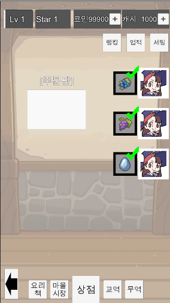

# 첨부파일 설명

## Client.zip

* 개인적으로 개발하고 있던 게임 이세계 레스토랑 클라이언트 소스 코드입니다.(결국 완성은못했지만..)
* 마이홈이나, 팜빌 같은 팜류 게임 장르이며, 동기화는 오직 Web서버로 이루어집니다.
* CL은(CoreLayer)의 약어입니다. 주로 게임개발에 공통적으로 재사용될 여지가 있는 코드는 다 이 접두어가 붙습니다.
* FI는(FantasyInn)의 약어입니다. 게임 시스템 및 컨텐츠 부분의 코드들은 주로 이 접두어가 붙습니다.
* Zenject는 DI(Dependency Injection)입니다. 의존성 주입용도로 많이 쓰며, 코드의 TestDriven을 쉽게 하기 위해서 쓰는 프레임워크입니다.
* UniRx는 (ReactiveExtension)반응성 높은 게임을 짧은 코드로 짜기 위해 쓰이는 프레임워크입니다.
* StaticData는 게임의 컨텐츠 적인 부분을 담당하고 있습니다.(예를들면 유저경험치테이블,아이템데이터) 이는 아래에 기술할 GameDataEditor에서 Schema로 작성되며, 에디터에서 코드로 내뱉어집니다.관련 클래스로는 GDManager,GDSchemeDef,GDScemeInst등이 있습니다.
* RuntimeData는 서버에서 들고 있어야 할 데이터를 의미합니다.(예를들면 유저 현재 레벨 미치 현제 경험치, 가지고 있는 아이템정보 등) 관련 클래스 및 인터페이스는 IRuntimeData,IDataProvider, FIServerRuntimeData 등이 있습니다.
* FIReq*관련 클래스는 실제 서버처럼 Request,Response방식으로 짜여져 있습니다. 서버가 없어도 테스트할수 있게끔 환경을 만들어놓은 거죠. 컨텐츠 테스트가 끝난 후에 여기에 있는 코드들을 서버로 적당히 수정해서 옮기면 바로 되도록 하기 위함입니다.

## Server.zip
* Asp.Net.Core를 사용합니다.
* Azure에 서비스할수도 있고 AWS에도 할 수 있습니다.
* 실행하기 위해서는 DotnetCore관련된 라이브러리 설치 후에 가능합니다. 
* MSSQL,Redis를 사용합니다.
* 굳이 PHP나 NodeJS등 사용해도 되지 않냐 하실 수 있지만, 제가 혼자서 다 개발을 해야하기에 C#으로 할 수 있는 방법으로 채택됬습니다.Asp.Net을 쓸수도 있었겠지만, 제가 주 개발환경이 맥이다보니 맥에서도 돌아가는 Asp.Net.Core를 채택했습니다.
* 현재는 실행하셔도 실제 클라와 연동되진않습니다. 소스코드 보는 용도로 사용해주세요.

## GameDataEditor.zip

* 게임 데이터를 게임에서 Deserialize하는 건 언제나 노동이어서(엑셀에서 파싱해와서 인스턴스 만들고 데이터를 입력해넣어야 하니..) 에디터를 따로 만들었습니다. Schema에서 클래스를 정의하고 Property를 설정해주면 알아서 클래스 파일인 GDSchemeDef.cs로 뽑아줍니다.
* Data영역에서는 Schema에 맞춰서 데이터를 입력이 가능합니다. IsExcel 체크를 하시면 엑셀처럼 데이터를 넣을수도 있습니다.
* 굳이 Unity의 내장된 GUI를 사용하지 않은 이유는, 이 데이터가 서버에서도 쓰이기 때문입니다. 그리고 기획자가 매번 유니티에디터 열고 데이터 입력해야한다면 그것도 번거로워보여서요.
* 에디터를 사용하기 위해서는 Mono가 설치되어 있어야 합니다.
* 데이터가 많아지면 좀 느릴수도 있습니다. 최적화까진 되있진 않거든요.

## BehaviorTreeEditor.zip

* 현재 제공한 프로젝트에서는 쓰이진 않지만, RTS의 인공지능을 개발할때 쓴 Behave라는 (BehaviorTree에디터)에디터 덕을 많이 봤습니다. 그래서 직접 만들었습니다.
* 하지만 유니티에서 제공하는 BehaviorTree런타임은 전부 업데이트가 렌더링 기반이라 Lockstep(Deterministic Update)가 불가능하여 직접 구현할수밖에 없었습니다.
* 에디터를 사용하기 위해서는 Mono가 설치되어 있어야 합니다.
* 그냥 이런게 있구나 하고 봐주시면 감사하겠습니다.

## AssetBundleLoader.zip
* 애셋번들과 관련된 스크립트이며, 실제 이전 프로젝트에서도 사용했습니다.
* ContentsLoader는 CDN으로부터 애셋번들을 받아서 버전에 따라 패치하는 기능을 담당합니다.
* ContentsProvider는 ContentsLoader로부터 받아진 애셋번들로 작동됩니다. 유니티의 Resources.Load처럼 경로를 주면 애셋을 로드합니다만 내부적으로 찾고자 하는 애셋이 담긴 애셋번들을 추적하여 꺼내오는 일을 해줍니다.