#김성진 포트폴리오.
##Table of content.
1.[슈퍼마리오 모작](#SuperMario)

##SuperMario
key|value
------|-------
제작시기|2010년5월
작업인원|1인
소요시간|1주일
사용언어|C언어
개발툴&라이브러리|VisualStudio & WinAPI
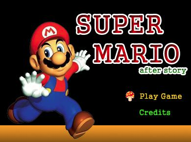
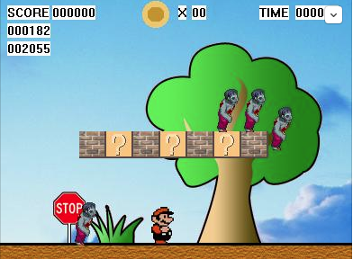
###관련기술
*C언어  
*WinAPI  
*픽셀충돌처리방식  
*Sprite Animation로직 구현
###세부내용
*어렸을적부터 게임을 좋아해서, 만든 게임!  
*대학교 1학년때 스터디 동아리에서 동계작품전으로 만듬.  
*좀비를 밟으면 좀비대신 플레이어가 죽는다. 이당시에는 초짜라서 세세하게 모든 매카니즘을 다 구현할수는 없었음.  
*WinAPI의 GetKeyState를 게임 입력으로 쓰면 안된다는걸 알게되었다.(이유는 메모장에 아무 알파벳이나 꾹 눌러보면 알게됨)  
*CPU로 렌더링하는게 얼마나 느린지 알게된 계기. 괜히 DirectX나 OpenGL쓰는게 아니었어.  
##iVindictus
key|value
------|-------
제작시기|2010년8월
작업인원|1인
소요시간|1개월
사용언어|ObjectiveC
개발툴&라이브러리|Xcode,SQLite+CoreData,CocoaFramework,UIKit
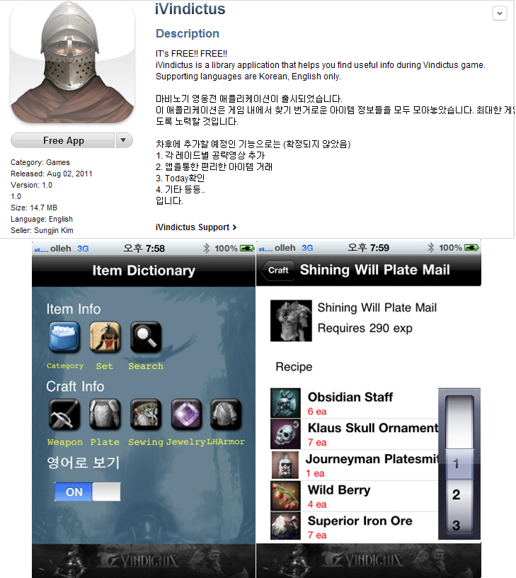
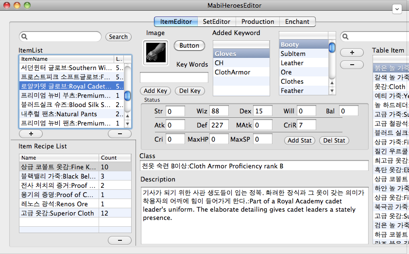
###관련기술
*IOS 프로그래밍  
*XCODE 빌드 및 배포 과정  
*가벼운 Database처리 기술  
*MVC  
*Mac기반 에디터 제작  
###세부내용
*한때 마영전에 흠뻑 빠져있었던 터라 만들어봄  
*에디터 툴을 만들어서 직접 데이터를 집어넣음  
*앱만드는것보다 데이터 수집하고 입력하는게 더 힘들었었음. 인터넷으로 검색이 안되는 데이터는 직접 플레이하면서 넣음. (덤으로 영어버전도 지원해서 노동은 2배이상)
##한경M&M iPAD 디지털 잡지 솔루션
key|value
------|-------
제작시기|2011년2월
작업인원|1인
소요시간|4개월
사용언어|ObjectiveC
개발툴&라이브러리|Xcode,SQLite+CoreData,CocoaFramework,UIKit
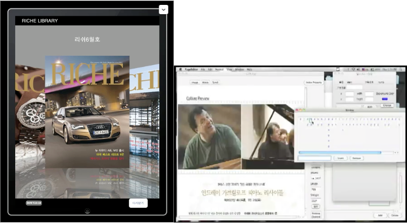
###관련기술
*Mac기반 에디터 제작  
*단순한 로컬라이징 기능  
*웹스토리지로부터 컨텐츠 다운로드 가능
###세부내용
*부모님이 출간하는 잡지를 사람들이 안읽게 되어 고민했음.  
*부모님 잡지회사를 위해서 잡지 컨텐츠를 모바일로 볼 수 있도록 하는게 주 목적. 요즘 누가 잡지 읽어, 인터넷보는데, 대세는 디지털 컨텐츠야!  아이패드로 앱 만들어서 잡지를 보여주면 분명 읽을거야!  
*툴을 이용해서 페이지들을 편집이 가능. 동영상,스크롤링,인덱싱 등 다양한 기능 지원  
*출시 후 느낀점. 이렇게 만들어놔도 안읽는 사람은 안읽는다는걸 알게되었다.
##Android Developer Korea 운영
key|value
------|-------
활동시기|2011년10월~12년2월
직책|부운영자
업무|Facebook페이지 운영 및 모임 주선
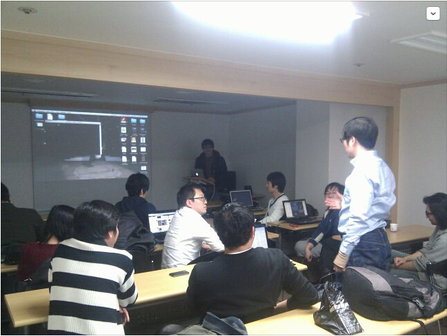
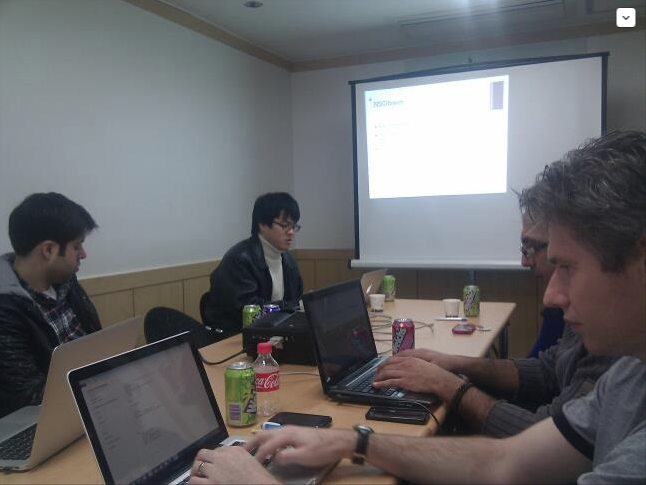
###세부내용
*코딩만 하지말고 주말에 생산적인 활동이 뭐가 있을까 하다가 들어가게 된 그룹. 페이스북 그룹이다 보니 외국인 개발자들이 많이 모임. 목적은 개발자들끼리 친목질 하자.  
*운영자 분은 10년동안 삼성하청업체에서 개발하던 형님. 서로 죽이 잘 맞아 꽤 재밋게 운영.    
*요청이 들어와서 안드로이드 모임에서 아이폰 개발강좌도 함.  
*외국인 개발자분들이랑 같이 협업한번 해보자 해서 게임도 만듬.  
*결국은 터졌음. 이유는 회원 중 한분이 어느 소프트웨어 사장인데, 노골적으로 회원들을 자기 회사로 끌어들이려고 연락을 하는 바람에 거의 나감. 운영자 형님은 개발자들에게 영어를 가르치는 일을 하신다고 부산으로 떠나고 혼자서 운영할 수는 없기에 그만둠.
##Turf(GPS를 이용한 땅따먹기 게임)한국 현지화
key|value
------|-------
제작시기|2011년12월
작업인원|1인
소요시간|-
사용언어|한국어?
개발툴&라이브러리|GoogleSpreadsheet
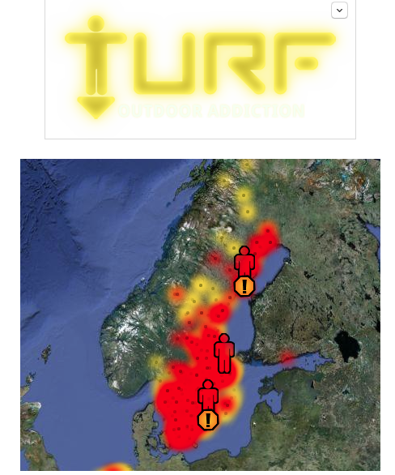
###세부내용
*스웨덴 게임에서 유행하던 Turf을 한국어로 바꿔서 한국에서 서비스.  
*Android Developer Korea 페이스북 페이지에 해당 개발자가 현지화를 요청. 계약 후 작업해서 출시.  
*알고리즘이 있어서, 맵에서 땅따먹을 지역을 알아서 분배해주지만, 못들어가는 지역은 수동으로 걸러주는 작업을 함.(예를들어 청와대,DMZ)  
*결론은 잘 안됐음. 스웨덴 사람들은 여가시간이 많아서 그런지 이곳저곳 많이 돌아다니는데(심지어 섬도 배타고 가서 땅을 차지할정도로) 한국에서는 다들 지하철 주변 땅만 차지할뿐, 그 이상 돌아다니려 하지 않음.
##MyPet(졸업작품전) + HSEngine(자체제작 OpenGL엔진)
key|value
------|-------
제작시기|2012년10월
작업인원|4인
소요시간|1개월
개발툴&라이브러리|Eclipse,AndroidSDK,OpenGLES
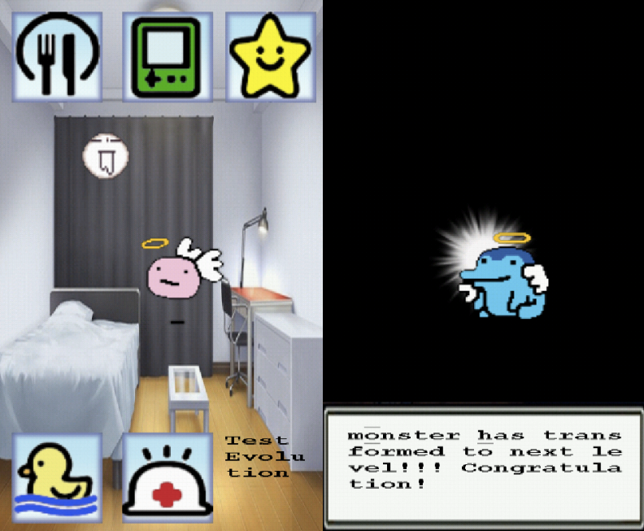
###관련기술
*Android앱 개발  
*OpenGLES 프레임워크 습득  
*View시스템 구축(ObjectiveC UIView를 참고로 한)  
###세부내용
*학교는 졸업하기전에 작품을 하나 내야 졸업을 시켜주기에 만든 작품.  
*이전에 DirectX를 공부하긴 했지만, 모바일은 OpenGL밖에 안되더라. 그래서 OpenGLES를 기반으로 2D엔진을 만듬.(엔진이라고 하기에는 정말 조잡하긴 하지만..)  
*OpenGLES는 정말 기초적인 렌더링 파이프라인만 지원하기때문에, vertex shader,fragment shader도 다 만들어 넣어야하고, glLookAt같은 원근투영되는 절두체를 위한 함수도 제공을 안하기에, 행렬도 전부 만들어 줘야 했다. 실제로 소요시간1개월은 OpenGL과 기본적인 AndroidSDK 배우는데 든 시간이 대부분.  
*컨텐츠는 단순 다마고치 키우기와 비슷. 정말 졸업을 위한 작품이었음.  

##Soul of Legend 개발
key|value
------|-------
회사|앱크로스
재직기간|2013년3월~13년9월
작업인원|클라이언트2명,서버2명,디자인3명,기획1명
소요시간|(개발)1년2개월(서비스)4개월
사용언어|C#
개발툴 및 프레임워크|클라이언트(Unity),서버(Photon),SVN
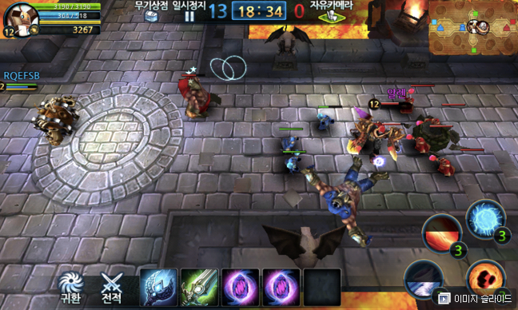
###관련기술
*Unity처음으로 접하고 대체적인 기능들에 대해 숙달됨.  
*Entity Component기반으로 게임월드를 구현.  
*BehaviorTree를 이용한 꽤 쓸만한 인공지능 구현.  
*타일기반한 AStar를 이용한 패스파인딩.  
*P2P Lockstep기반 네트워크 동기화 구현.  
*접속끊어진 후 재진입이 가능하도록 GameWorld Snapshot Serialize/Deserialize 구현
*NGUI 사용
###세부내용
*학교 졸업 후 처음으로 들어가게 된 게임회사.  
*초기에는 싱글 RPG로 시작했다가, 사장님이 당시 AOS장르(혹은 MOBA)의 대작인 리그 오브 레전드에 꽃히시는 바람에, 비슷한 장르로 Mobile로 만들어보자고 방향을 선회함.  
*맡은업무는 초기에는 단순한 클라이언트 전투 로직이었지만, 게임 장르 변경 후 네트워크가 지원되야 했기에 덤으로 게임월드 상태의 동기화 부분까지 맡게됨.  
*동기화는 열심히 구글링과 고민끝에 ClientServer방식이 아닌 P2P Lockstep(입력만 주고받는)동기화 기법을 사용함.  (서버 부하가 적고 입력만 동기화 가능하다면 클라이언트 기반 게임도 네트워크플레이가 된다! 물론 단점도 많지만..)  
*게임은 잘 런칭하였지만, 잦은 버그와 해킹시도때문에 사람이 많이 없어짐. 다행이 내가 회사를 나온 이후에 Soul of legend를 기반으로 후속작 *Legend of master*와 *덴마*라는 게임도 출시. 지금은 잘 되고 있는 것 같음.   
*1년6개월동안 개발하다보니 정신적으로 환기를 시킬 필요가 있음을 느껴 퇴사함.  
##유럽여행
key|value
------|-------
시기|2013년10월~12월
소요시간|2개월
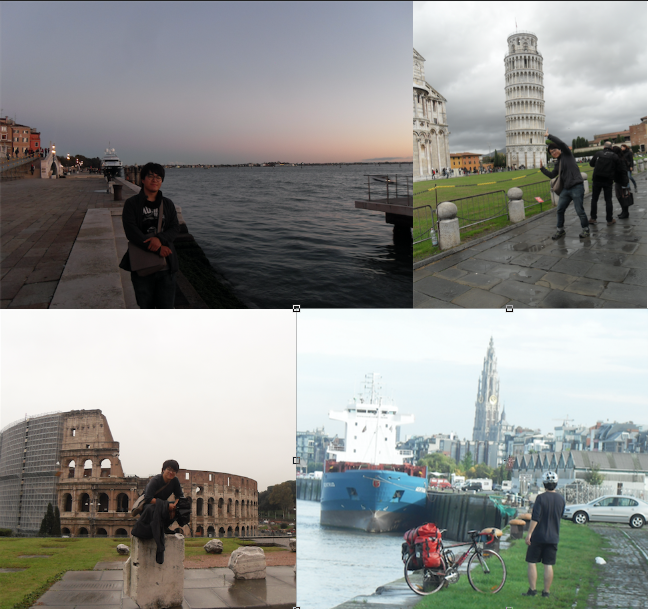
###세부내용
*자전거 하나 들고 영국->프랑스->벨기에->네덜란드->독일->스위스->이탈리아를 여행  
*교통편을 이용해서 건너뛴 나라가 한두군데 있지만 거의 자전거만 이용함  
*미친짓을 한번 해보고 싶어서 시도.  
*실제로 가능한지 알아보기 위해 모의실험으로 서울에서 부산까지 4박5일(500킬로미터) 자전거로 가봄. 결론은 가능하다!  (몸무게5킬로 빠진건 보너스. 그리고 포카리스웨트 중독)  
*유럽 자전거 여행이 재미있을거라 생각했지만 실상 괴로운 일이 더 많았음. (프랑스에서 현지인이 재워준다길래 잤는데 게이였다던지, 길에 유리파편으로 타이어가 전부 펑크나 모르는 사람 집 헛간에서 몰래 잔 거라던지..)  
*계획은 열심히 세워놔도 현장에서는 준비한 것들이 다 박살나는 것을 몸소 체험.  
*여러가지 문화적인 체험도 많이 하고, 독특한 사람들도 많이 만나고, 대중교통이 아닌 직접 몸으로 세상의 크기를 재보는 것은 신선했음.  
##데미갓워 개발
key|value
------|-------
회사|파라노이드조이
재직기간|2013년1월~13년9월
작업인원|총13명 (클라이언트4명,서버2명,디자인3명,기획4명 유동적)
소요시간|(개발)1년2개월(서비스)4개월
사용언어|C#
개발툴 및 프레임워크 등|클라이언트(Unity),서버(nodeJS),AWS,SVN
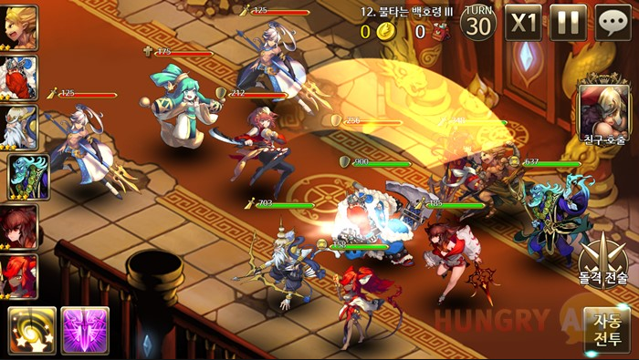
###관련기술
*클라이언트 전투 로직 담당  
*아트팀과 커뮤니케이션 역할  
*클라이언트 팀원 업무 스케쥴 관리  
*nodeJS를 이용한 스케일아웃 가능한 서버 인프라 구축 배움  
*위의 경험으로 nodeJS기반 결제 서버 제작  
*위의 경험으로 컨텐츠 패치 서버 & 버전관리툴 제작  
*shellscript로 조잡한 autobuild솔루션 제작(버튼하나 누르면 안드로이드,IOS빌드가 뚝딱)
###세부내용
*여행을 끝내고 와서 전 회사 아트를 담당한 지인의 소개로 들어가 만든 게임  
*게임은 요즘 봇물처럼 쏟아지고 있는 반실시간턴제 RPG. 피로도 소모하고 들어가서 몬스터 잡고 클리어! 이런거..  
*클라이언트 2명이서 프로토타이핑 하고 있었고,나도 같이 껴서 프로토타입 완성함.   
*서비스를 위해서 2명은 서버로 가고, 그나마 유니티에 가장 익숙한 내가 클라이언트에 남음.  
*컨텐츠 추가를 위해 클라이언트 3명을 더 채용, 나보다 더 나이많은 개발자들을 받아놓고 팀장을 시킴. 싫지만 어쩔수 없이 맡게 됨.  
*팀장은 처음이어서 나름 팀원분들이랑 친해지려고 무단 노력을 함. 좀 친해진다음엔 자연스럽게 업무를 분담해드림.  
*컨텐츠 개발은 팀원분들에게 맡기고, 결제 관련 플러그인 만들면서 nodeJS서버를 자연스레 접하게 됨.  
*출시하고 한달안에 구글최고매출30위 안으로 들어가는 나름 기적을 봄!  
*하지만 이후에 사장과 주요급 인사들이 마찰이 생겨 대부분 나오게 됨. 꽤 친해진 멤버들이 다 나가버리는 바람에.. 이렇게된거 그냥 나와서 나만의 게임을 만들어야 겠다 라는 생각으로 나옴.
##서울디지텍고등학교 기업반 담당선생님
key|value
------|-------
학교|서울디지텍고등학교
담당업무|학교 기업반 운영
취직이유|인디 개발 시간 확보를 위해 
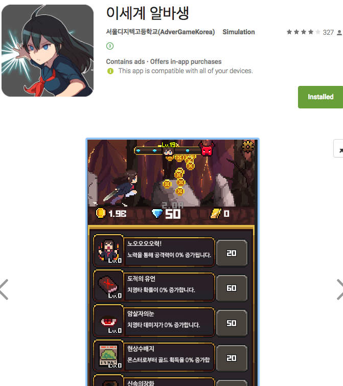
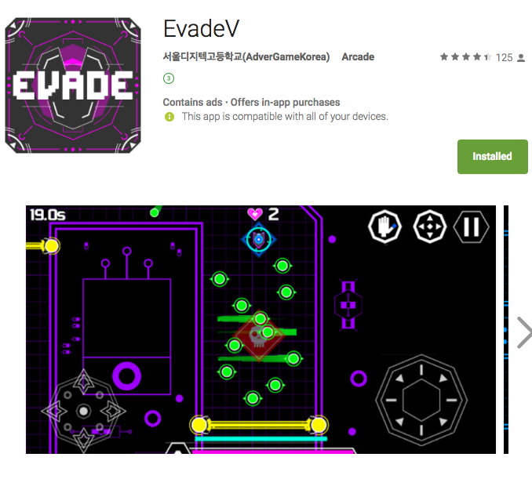
###관련기술
*게임 제작 프로세스 관리(학생 대상으로)  
*게임 기획 기술(MDA Framework같은거)에 대한 전반적인 공부  
###세부내용
*이전 회사를 소개시켜준 그래픽 디자이너와 둘이 인디개발을 시작하기로 함.  
*하지만 돈도 없이 개발만 하는건 무리라고 판단, 학교에서 기업처럼 애들을 현장실습시켜줬으면 한다고 해서 둘이 학교로 들어가게 됨.  
*월급은 적지만, 애들 게임 제작 프로세스 관리정도만 해주고 나머지 시간은 맘대로 하라고 함. 전용 사무실도 받음!  
*아이들 대상으로 2팀(3명,2명)해서 게임 개발 프로세스를 관리.  
*EvadeV라는 게임과 이세계여고생이라는 게임을 출시함. 둘다 합쳐서 500만원 정도 벌었음.  
*돈은 많이 못벌었지만, 전원 다른회사에 병특으로 성공적으로 병역을 회피함! 결과적으로 학교에서도 매우 좋아함.  
##트오세포럼(TOS FORUM)
key|value
------|-------
제작기간|1개월(서울디지텍고등학교 재직 중)
사용한것들|Unity,UGUI,C# Mono,HttpServer,TcpServer,SVN
제작이유|게임 서비스를 위한 기반 프레임워크 제작 및 휴식겸
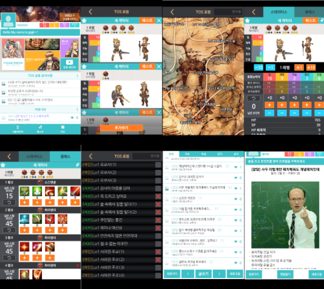
###관련기술
*C# Mono HttpServer를 이용한 프론트엔드/백엔드 서버 프레임워크 제작  
*GuestLogin구현(엄밀히 말하면 DeviceID로그인)  
*Redis,SQL연동  
*C# TCP/IP기반 채팅서버 구현  
*위의 것들의 퍼포먼스를 위해 기본적으로 멀티스레딩 처리또한 적용  
*서비스를 위한 AWS 사용  
###세부내용
*여가시간 나는대로 동업자와 같이 게임 기획을 해보았지만, 기획경험이 없는 둘로써는 계속 만족스럽지 못한 프로토타입만 만들어냈음.  
*4개월간 강행하다가 잠시 쉴겸, 트리오브세이비어 팬 앱인 *트오세포럼*을 모바일로 출시.  
*C#으로 구현한 웹서버가 붙어있어, 실시간 채팅 및 게시판 기능도 있고, 기본적인 트리오브세이비어 관련 정보들을 앱에서 보는게 가능함.  
*생각보다 방문자가 많아서 AdMob과 UnityAds로부터 광고료 짭짤하게 범.  
*하지만 단순히 .Net Standard에서 제공하는 HttpServer를 이용해서 밑바닥부터 만들었기에, 예외적인 처리나 기본적으로 IIS같은 이미 만들어진 프레임워크들이 주는 이점들을 전혀 이용을 할 수 없었음.  
*굳이 서버를 C#으로 짜야했던 이유는 클라이언트와 서버 프로그래밍을 혼자서 해야 하는 입장에서 전에 썼던 nodeJS를 쓸수가 없었음. javascript는 내 메인 언어는 아니었기에.. Fault Tolerant한 서버를 만들기위해서는 언어에 대한 이해가 깊어야 하는데, javascript를 그렇게 깊게 한적도 없었고, 언어를 병행하면서 오는 혼란때문에 엉뚱한 코드를 짜게 되면, 그건 결국 서비스의 질적 하락으로 이어질 수도 있기 때문이었음.  
##판타지선술집(가칭)
key|value
------|-------
제작기간|4개월(서울디지텍고등학교 재직 중)
장르|팜류RPG
사용한것들|Unity,UGUI,Asp.Net.Core MVC,MsSql,Redis,Azure,Docker,Zenject,UniRx,Git
###관련기술
*asp.net.core를 이용한 프론트엔드/백엔드 게임 서버 프레임워크 제작  
*Redis,MSSQL연동  
*DeviceLogin,FacebookLogin 구현  
*redis sessionID를 기반한 세션 구현(TokenBased는 asp.net.core에서 아직 미구현되어있어서..)  
*FakeServer in Client(클라에 서버가 있는듯하게 구현, 이로인해 체크만 해주면 바로 서버로 연결이 가능. 서버없이도 원활한 테스트를 할수있도록 하기 위함)  
*결제인증서버 구현(일단 구글만)  
*UniRx  
*Zenject로 TestDriven이 쉽도록 함(Mock만 해주면 되기에 테스트에 용이하고 Dependency때문에 골치아파할게 없어짐)  
*Docker로 프로젝트 이미지 관리(를 목적으로 배웠지만, 지금은 Mac에서 MsSql돌리는 용도로 전락)  
###세부내용
*갖은 고생끝에 기획을 팜류게임으로 정하고 프로토타입을 제작 후 가능성있다고 판단하여 시작.  
*생으로 웹서버를 제작하는것보다 기존 만들어진 프레임워크를 써야겠다고 판단하여 알아봄.  
*근래 마이크로소프트가 Asp.Net.Core를 한창 지원중이었음. 이거면 되겠다고 판단. 제일 중요했던건 맥에서도 C# 서버가 돌아간다는 거였다! 마소가 갑자기 왜이렇게 착해졌지.  
*무료 AWS 1년 Subscription이 종료됨. 이왕 이렇게 된거 Azure로 갈아타자. Asp.net도 마소꺼니까 IIS에서 좀더 퍼포먼스가 나오겠지.  
*기반 구조도 다 짜놓고, 데이터 입력 툴도 만들었고, 밸런스도 맞췄고 해보니 꽤 재밋어, 될거같아! 이젠 아트만 입히고 베타 몇번 하고 고칠거고치고 서비스하면 돼! 그런데..  
*막바지에 동업자 부모님이 몸이 편찬으셔서 부산으로 가게됨..  
*....

